<div align="center">

<a href="https://khalid-annan.com"></a>


</div>

---

**Network &amp; security engineer who builds the tools he secures with.** Qualified network engineer *(Yrkeshögskoleexamen, Nätverksspecialist)* with hands-on SOC analyst experience — designing, building, and securing real infrastructure.

**Recent** &emsp; Designed a segmented four-zone SOC lab with SIEM-based threat detection *(thesis)*. SOC analyst placement — evaluated *"ready for entry-level SOC analyst roles."*


<br>

```
─── Security & Detection ──────────────────────────────────────────────
```

<div align="center">


</div>

```
─── Infrastructure & Automation ───────────────────────────────────────
```

<div align="center">


</div>

<br>

---

<div align="center">

[`khalid-annan.com`](https://khalid-annan.com) &nbsp;·&nbsp; [`linkedin.com/in/khalid-annan`](https://linkedin.com/in/khalid-annan) &nbsp;·&nbsp; [`credly`](https://www.credly.com/users/khalid-annan) &nbsp;·&nbsp; `mail@khalid-annan.com`

</div>
